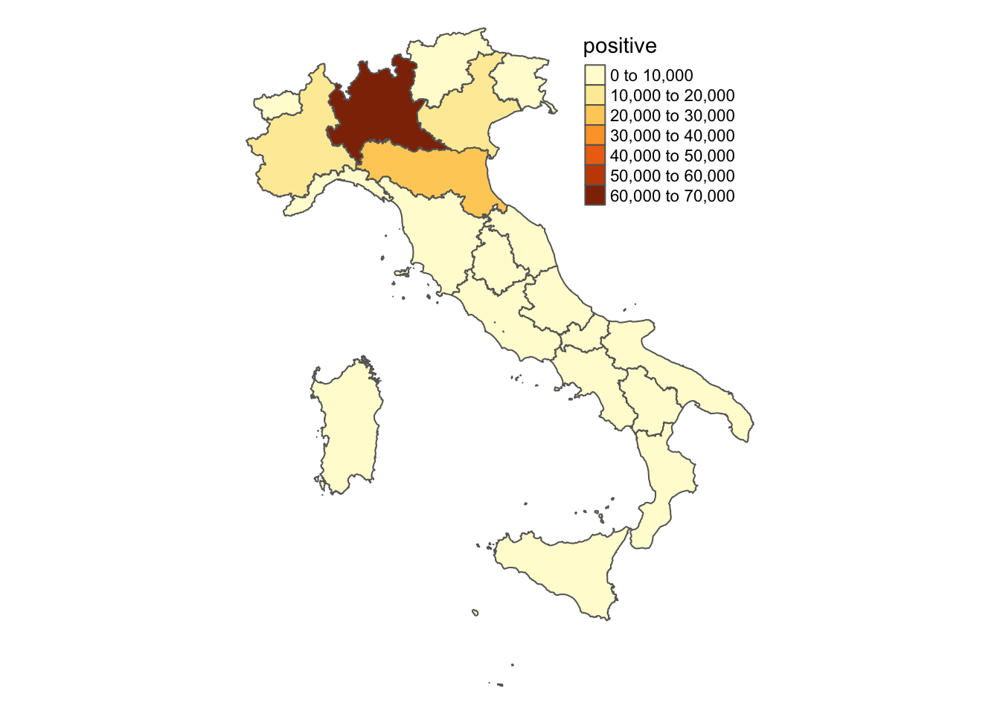
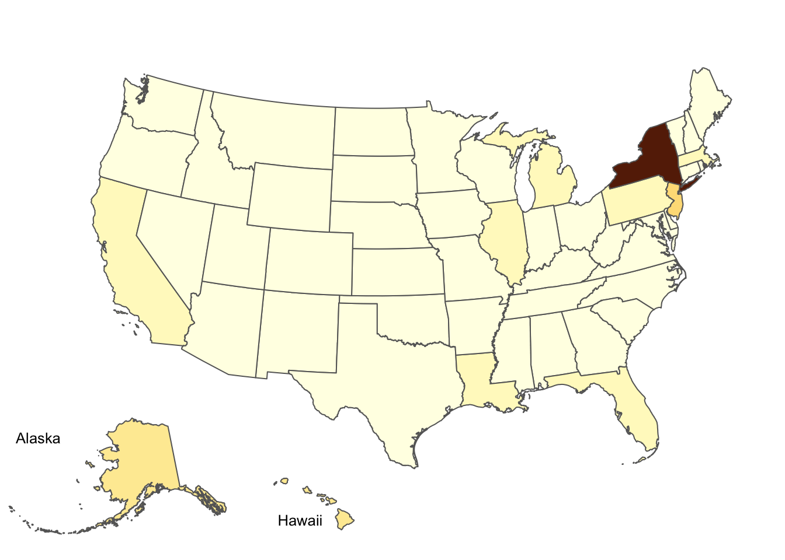
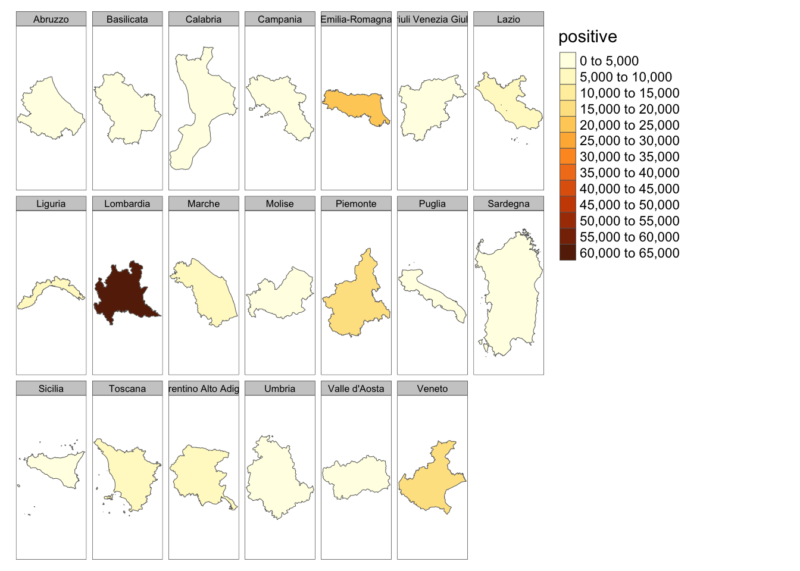
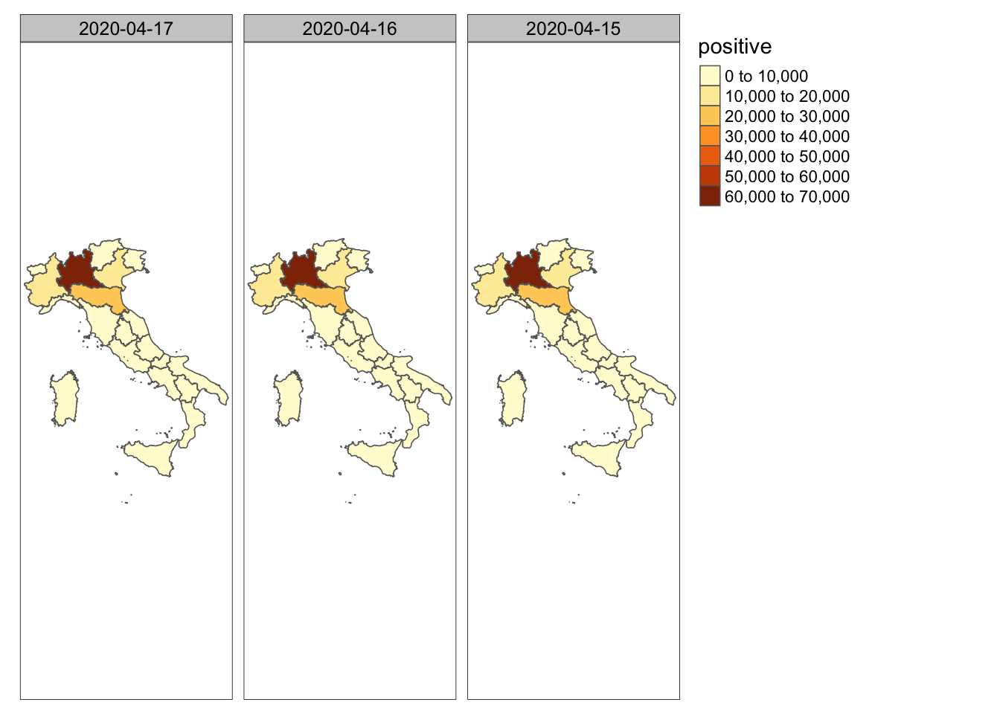
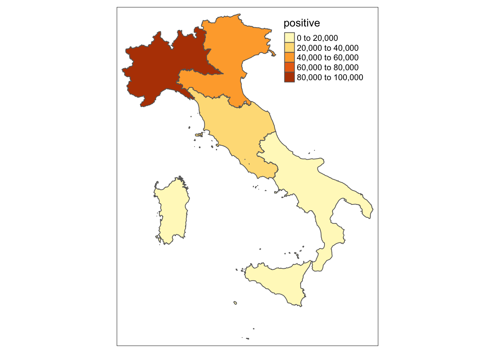
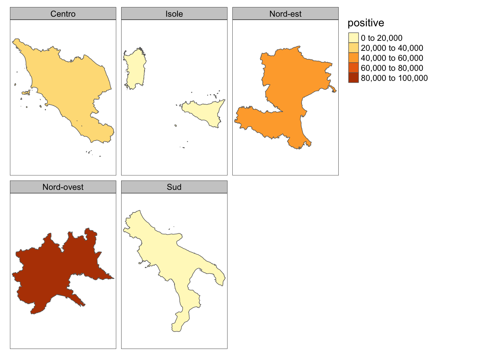

# COVID-19 Datasets with Coordinates

This repository aims to simply the visualisation of the COVID-19 datasets. Data and geometries are provided in the same file and with different formats to immediatly plot the data in R or other softwares for geospatial data.

The `R` folder provides functions to directly download the data in `R`, for _Italy_, and _USA_.

For more details on the functions and packages used look at the references section.


## Download in R (`getDataCovid`)

| functions | description|
------------|------------|
| `getDataCovidIT()`| retrives data from this repository for the italian cases |
|`getDataCovidUS()`| retrives data from this repository for the United States of America cases |
------------------------------------------

### Italy

Data can be downloaded first loaded the R function `getDataCovidIT()` available in the `R` folder of this repo:


```r
library(devtools)
source_url("https://raw.githubusercontent.com/dataallaround/mapCOVID19/master/R/getDataCovidIT.R")
```

`getDataCovidIT()` requires the date in the format `yyyy-mm-dd`, and the geographical level, "regioni" or "province":


```r
dt = getDataCovidIT(date = "2020-04-17", level = "regioni")
names(dt)
```

```
##  [1] "date"                       "ripartizione"               "regione"                   
##  [4] "hospitalized"               "ventilation"                "hospitalized_total"        
##  [7] "confinement"                "current_positive"           "variation_current_positive"
## [10] "new_positive_total"         "recovered"                  "death"                     
## [13] "positive"                   "tests"                      "geometry"
```

for "regions", and for "province":


```r
dt = getDataCovidIT(date = "2020-04-17", level = "province")
names(dt)
```

```
## [1] "regione"      "provincia"    "date"         "ripartizione" "positive"     "geometry"
```

Multiple `date` can be loaded and aggregate in a single file:


```r
dt = getDataCovidIT(date = c("2020-04-17","2020-04-16"), level = "regioni")
names(dt)
```

```
##  [1] "date"                       "ripartizione"               "regione"                   
##  [4] "hospitalized"               "ventilation"                "hospitalized_total"        
##  [7] "confinement"                "current_positive"           "variation_current_positive"
## [10] "new_positive_total"         "recovered"                  "death"                     
## [13] "positive"                   "tests"                      "geometry"
```

Data can be also downloaded using "download_dir" in `getDataCovidIT()` function, indicating the destination directory. 

### USA

Data can be downloaded first loaded the R function `getDataCovidUS()` available in the `R` folder of this repo:


```r
library(devtools)
source_url("https://raw.githubusercontent.com/dataallaround/mapCOVID19/master/R/getDataCovidUS.R")
```

`getDataCovidUS()` requires the date in the format `yyyy-mm-dd`, for only the states of US:


```r
dtUS = getDataCovidUS(date = "2020-04-17")
names(dt)
```

```
##  [1] "date"                       "ripartizione"               "regione"                   
##  [4] "hospitalized"               "ventilation"                "hospitalized_total"        
##  [7] "confinement"                "current_positive"           "variation_current_positive"
## [10] "new_positive_total"         "recovered"                  "death"                     
## [13] "positive"                   "tests"                      "geometry"
```

Multiple `date` can be loaded and aggregate in a single file:


```r
dt = getDataCovidUS(date = c("2020-04-17","2020-04-16"))
names(dt)
```

```
##  [1] "abbr"                 "state"                "date"                 "Confirmed"           
##  [5] "Deaths"               "Recovered"            "Active"               "FIPS"                
##  [9] "Incident_Rate"        "People_Tested"        "People_Hospitalized"  "Mortality_Rate"      
## [13] "UID"                  "ISO3"                 "Testing_Rate"         "Hospitalization_Rate"
## [17] "geometry"
```

Data can be also downloaded using "download_dir" in `getDataCovidUS()` function, indicating the destination directory. 


## Static maps in R

Some examples to map the data in R software.


```r
library(sf)
library(tmap)
library(cartography)
suppressMessages(tmap_mode("plot"))

dt = getDataCovidIT(date = "2020-04-17", level = "regioni")
dtUS = getDataCovidUS(date = "2020-04-17")
```


```r
tm_shape(dt) + tm_borders() + tm_fill("positive") + tm_layout(frame = FALSE)
```




```r
library("grid")
alaska <- tm_shape(dtUS[dtUS$state=="Alaska",], projection = 3338) + tm_borders() + tm_layout("Alaska", legend.show = FALSE, bg.color = NA, title.size = 0.8, frame = FALSE) + tm_fill("Confirmed", n = 10) 

hawaii <- tm_shape(dtUS[dtUS$state=="Hawaii",], projection = 3759) + tm_borders() +    tm_layout("Hawaii",legend.show = FALSE, bg.color=NA, title.position = c("LEFT", "BOTTOM"), title.size = 0.8, frame=FALSE) + tm_fill("Confirmed", n = 10) 

alk <- viewport(x = 0.15, y = 0.15, width = 0.3, height = 0.3)
haw <- viewport(x = 0.4, y = 0.1, width = 0.2, height = 0.1)

tm_shape(dtUS[!(dtUS$state %in% c("Alaska", "Hawaii")),],  projection=2163) + tm_borders() + tm_fill("Confirmed", n = 10) +  tm_layout(legend.position = NULL, frame = FALSE, inner.margins = c(0.1, 0.1, 0.05, 0.05), legend.show = FALSE)
print(alaska, vp = alk)
print(hawaii, vp = haw)
```




```r
tm_shape(dt) + tm_borders() + tm_fill("positive", n = 10) + tm_facets("regione")
```




For different date we can plot as follows:


```r
dt = getDataCovidIT(date = c("2020-04-17","2020-04-16","2020-04-15"), level = "regioni")
tm_shape(dt) + tm_borders() + tm_fill("positive") + tm_facets("date")
```



Starting from `nuts3` (`regions`), we can aggregate, for example, by `nuts1` (`ripartizione`)


```r
dt = getDataCovidIT(date = c("2020-04-17"), level = "province")
dt_aggr <- aggregate(dt[,"positive"], by = list( group = dt[,"ripartizione", drop = TRUE]), FUN = sum)
tm_shape(dt_aggr) + tm_borders() + tm_fill("positive")
```



```r
tm_shape(dt_aggr) + tm_borders() + tm_fill("positive") + tm_facets("group")
```



## Dynamic map in R


```r
library(tmap)
library(mapview)
suppressMessages(tmap_mode("view"))

dt = getDataCovidIT(date = "2020-04-17", level = "regioni")
dtUS = getDataCovidUS(date = "2020-04-17")
```


```r
tm_shape(dt) + tm_borders() + tm_fill("positive")
```


```r
tm_shape(dtUS) + tm_borders() + tm_fill("Confirmed")
```


```r
mapview(dt, zcol = "positive")
```


```r
mapview(dtUS, zcol = "Confirmed")
```

## Sources

- [`Dipartimento della Protezione Civile Italiana`](https://github.com/pcm-dpc/COVID-19)
- [`ISTAT`](https://www.istat.it/it/archivio/222527)
- [`United States Census Bureau`](https://www.census.gov/geographies/mapping-files/time-series/geo/carto-boundary-file.html)
- [`Center For Systems Science and Engineering at JHU`](https://github.com/CSSEGISandData/COVID-19/tree/master/csse_covid_19_data)

## References

- <a href="https://cran.r-project.org/web/packages/sf/index.html">`sf`</a>
  - Pebesma, E., 2018. Simple Features for R: Standardized Support for Spatial Vector Data. _The R
    Journal_, 10 (1), 439-446, https://doi.org/10.32614/RJ-2018-009
  - https://r-spatial.github.io/sf/index.html  

- <a href="https://cloud.r-project.org/web/packages/mapview/index.html">`mapview`</a>
  - Tim Appelhans, Florian Detsch, Christoph Reudenbach and Stefan Woellauer (2019). mapview:
    Interactive Viewing of Spatial Data in R. R package version 2.7.0.
    https://CRAN.R-project.org/package=mapview
  - https://r-spatial.github.io/mapview/  

- <a href="https://cloud.r-project.org/web/packages/tmap/index.html">`tmap`</a>
  - Tennekes M (2018). “tmap: Thematic Maps in R.” _Journal of Statistical Software_, *84*(6), 1-39.
    doi: 10.18637/jss.v084.i06 (URL: https://doi.org/10.18637/jss.v084.i06).
  - https://cran.r-project.org/web/packages/tmap/vignettes/tmap-getstarted.html
  
